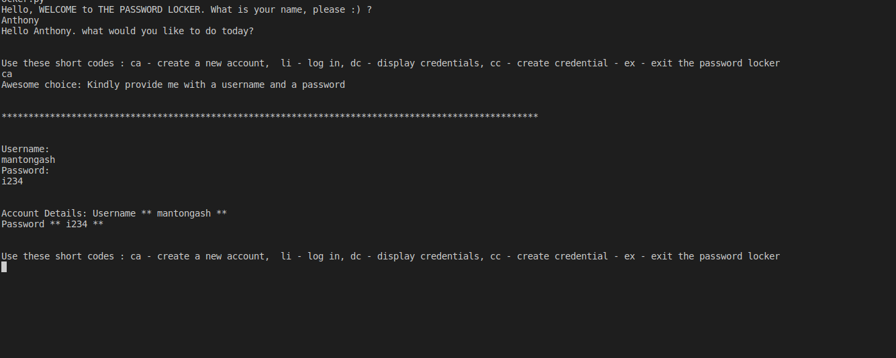

# Password Locker

### Description

---

This is a Python command-line program that enables a user to create an account, log in to that account and store passwords to different websites that the user has access to. It contains on-screen commands on how to perform various tasks, eg storage / retrieval of passwords and many more.

---

### Author

---

This is created and maintained by: [Anthony Ng'ang'a](https://www.github.com/users/Mantongash) - A Full Stack Web Architect and creator of things.

---

### BDD

---

1. Create an account

- INPUT: "Username"
- OUTPUT: "Username"
- INPUT: "Password"
- OUTPUT: "Password"

2. Log in to an account. Wrong details leads to an error.

- INPUT: "Username"
- OUTPUT: "Username"
- INPUT: "Password"
- OUTPUT: "Password"

3. Add credentials that a user wants to store:

- INPUT: "Username"
- OUTPUT: "Username"
- INPUT: "Account Name"
- OUTPUT: "Account Name"
- INPUT: "Account Password"
- OUTPUT: "Account Password"

4. Retrieve stored account details

- INPUT: "Username"
- OUTPUT: "Username"
- INPUT: "Account Name"
- OUTPUT: "Account Name"
- INPUT: "Account Password"
- OUTPUT: "Account Password"

---

### Set Up Instructions

---

Open your terminal and move to a directory where you would like to store the project, eg, `cd Desktop`. Then use this command `git clone https://github.com/Mantongash/password_locker.git` to clone it. Finally navigate to the project's root directory using `cd password-locker`. You can now run the project in the terminal using `python3 run_locker.py`

---

### Live Link

---

Since it's a command line application, it has no live link, but you can access the repo [here](https://github.com/Mantongash/password_locker).

---

### License

---

MIT Copyright (c) 2019 Anthony Ng'ang'a

Permission is hereby granted, free of charge, to any person obtaining a copy of this software and associated documentation files (the "Software"), to deal in the Software without restriction, including without limitation the rights to use, copy, modify, merge, publish, distribute, sublicense, and/or sell copies of the Software, and to permit persons to whom the Software is furnished to do so, subject to the following conditions:

The above copyright notice and this permission notice shall be included in all copies or substantial portions of the Software.

THE SOFTWARE IS PROVIDED "AS IS", WITHOUT WARRANTY OF ANY KIND, EXPRESS OR IMPLIED, INCLUDING BUT NOT LIMITED TO THE WARRANTIES OF MERCHANTABILITY, FITNESS FOR A PARTICULAR PURPOSE AND NONINFRINGEMENT. IN NO EVENT SHALL THE AUTHORS OR COPYRIGHT HOLDERS BE LIABLE FOR ANY CLAIM, DAMAGES OR OTHER LIABILITY, WHETHER IN AN ACTION OF CONTRACT, TORT OR OTHERWISE, ARISING FROM, OUT OF OR IN CONNECTION WITH THE SOFTWARE OR THE USE OR OTHER DEALINGS IN THE SOFTWARE.
